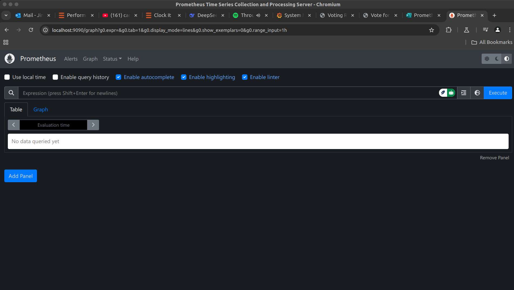
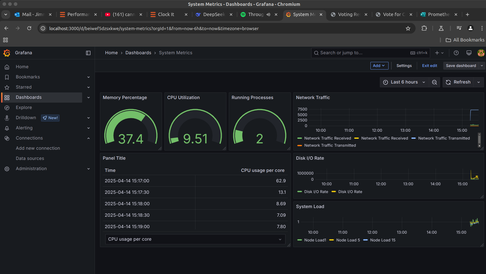

# Lab: Setting Up Prometheus and Grafana for Monitoring

## Objective

In this lab, I set up Prometheus and Grafana to monitor system metrics. I used Prometheus to collect and store metrics, while Grafana provided powerful visualization capabilities.

## Prerequisites

For this lab, I needed:
- Docker and Docker Compose installed on my machine
- Basic knowledge of Linux commands and system monitoring
- Internet access to pull Docker images

## Steps I Followed

### Step 1: Setting Up Prometheus

1. **I created a directory for Prometheus:**

   ```bash
   mkdir prometheus-grafana
   cd prometheus-grafana
   ```

2. **I created a Prometheus configuration file:**

   I created a file named `prometheus.yml` with the following content:

   ```yaml
   global:
     scrape_interval: 15s
   
   scrape_configs:
     - job_name: 'prometheus'
       static_configs:
         - targets: ['localhost:9090']
   ```

   This configuration told Prometheus to scrape metrics from itself (localhost:9090) every 15 seconds.

3. **I set up Docker Compose for Prometheus and Grafana:**

   I created a `docker-compose.yml` file with the following content:

   ```yaml
   version: '3'
   services:
     prometheus:
       image: prom/prometheus
       container_name: prometheus
       volumes:
         - ./prometheus.yml:/etc/prometheus/prometheus.yml
       ports:
         - "9090:9090"
     
     grafana:
       image: grafana/grafana
       container_name: grafana
       ports:
         - "3000:3000"
       environment:
         - GF_SECURITY_ADMIN_PASSWORD=admin
   ```

   I specified two services:
   - **Prometheus**: Exposing metrics on port 9090
   - **Grafana**: Exposing the dashboard on port 3000 with the admin password set to "admin"

4. **I started the Prometheus and Grafana containers:**

   ```bash
   docker-compose up -d
   ```

   This command downloaded the necessary Docker images and started the containers in detached mode.

### Step 2: Accessing Prometheus and Grafana

1. **I accessed Prometheus:**
   
   I opened my browser and navigated to http://localhost:9090 to see the Prometheus web interface.
   
   I tested it by querying `up` to check if Prometheus was working correctly and scraping metrics.

2. **I accessed Grafana:**
   
   I opened my browser and went to http://localhost:3000, then logged in using the default credentials:
   - Username: admin
   - Password: admin (I changed this after the first login for security)

### Step 3: Configuring Grafana to Use Prometheus as a Data Source

1. **I added Prometheus as a Data Source in Grafana:**
   
   - After logging into Grafana, I clicked the gear icon (⚙️) on the left sidebar and selected "Data Sources"
   - I clicked "Add data source", and chose Prometheus from the list
   - In the URL field, I entered `http://prometheus:9090`
   - I clicked "Save & Test" to confirm that Grafana could connect to Prometheus

### Step 4: Creating a Dashboard in Grafana

1. **I created a new dashboard:**
   
   - I clicked the "+" button on the left sidebar and selected "Dashboard"
   - I clicked "Add new panel"

2. **I added a Prometheus query:**
   
   In the Query section, I selected Prometheus as the data source and entered the following query to display CPU usage:
   
   ```
   rate(node_cpu_seconds_total{mode="idle"}[5m])
   ```
   
   This query retrieved the idle CPU time rate over the last 5 minutes.

3. **I customized the panel:**
   
   I adjusted the visualization type to Graph to see the time-series data of the CPU usage, which gave me a clear view of CPU utilization over time.

4. **I saved the dashboard:**
   
   Once I was satisfied with the panel, I clicked "Apply" to add it to the dashboard. Then, I clicked the disk icon in the upper-right corner to save the dashboard with the name "System Metrics."

### Step 5: Exploring Metrics

I added multiple panels to visualize different types of metrics. Some queries I used included:
- `node_memory_MemAvailable_bytes` for monitoring available memory
- `node_disk_io_time_seconds_total` for tracking disk I/O
- `node_network_receive_bytes_total` for measuring network traffic
  
I experimented with different queries and visualizations to create a comprehensive monitoring dashboard for my system.

### Step 6: Monitoring My Voting Application

1. **I added Prometheus annotations to my deployments:**

   I modified my Kubernetes deployment files to include Prometheus scraping annotations:

   ```yaml
   apiVersion: apps/v1
   kind: Deployment
   metadata:
     name: voting-app
   spec:
     template:
       metadata:
         annotations:
           prometheus.io/scrape: "true"
           prometheus.io/port: "8080"
           prometheus.io/path: "/metrics"
   ```

2. **I created a specific dashboard for my application:**
   
   I created a new dashboard in Grafana specifically for monitoring my voting application components, including panels for:
   - API request rates
   - Response times
   - Error rates
   - Database query performance

## Conclusion

I successfully set up Prometheus and Grafana on my machine. Prometheus is now collecting system metrics, and Grafana is visualizing them in real-time. I've integrated this monitoring setup with my CI/CD pipeline to ensure my voting application's health and performance are continuously monitored after each deployment.

This monitoring solution gives me visibility into both infrastructure metrics and application-specific performance indicators, which will help identify and address potential issues before they impact users.


## Relevant Images

## Prometheus Dashboard


## Grafana Dashboard
