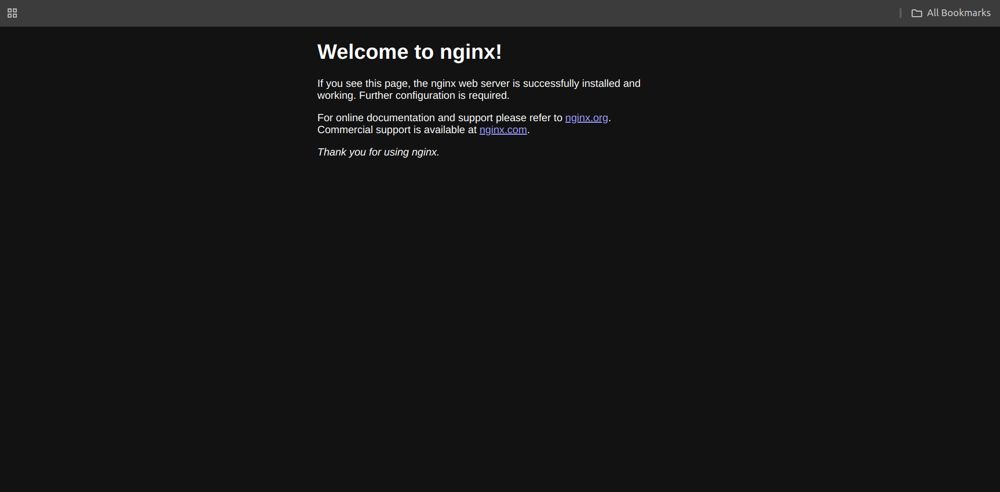
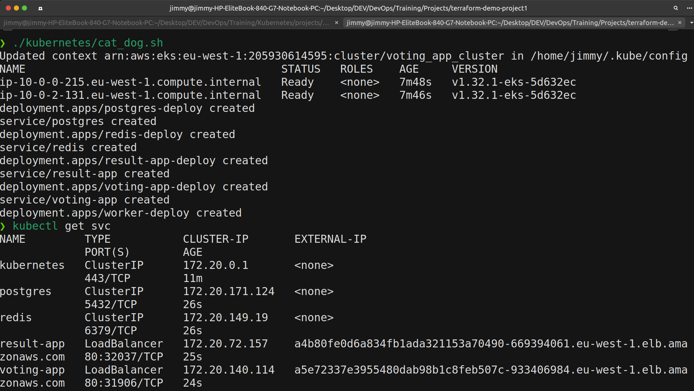
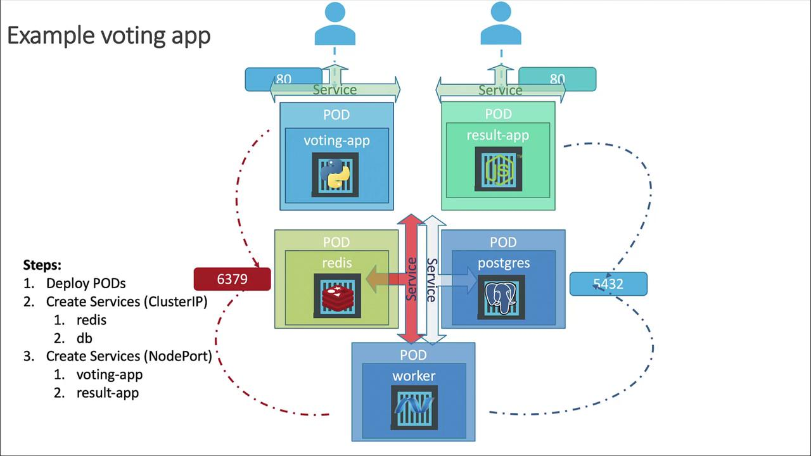
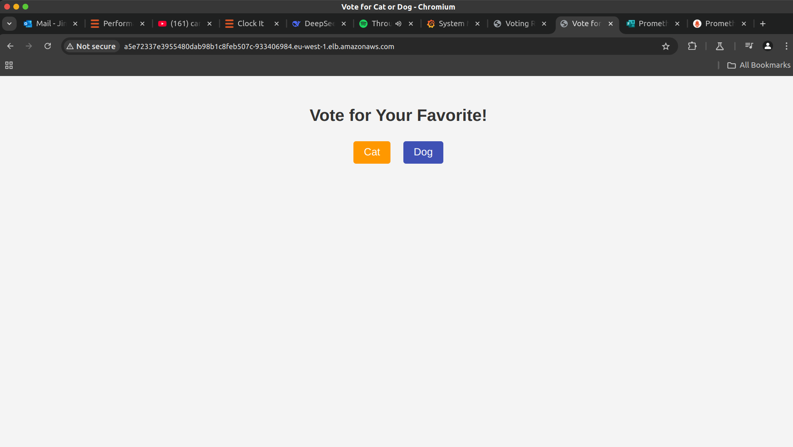
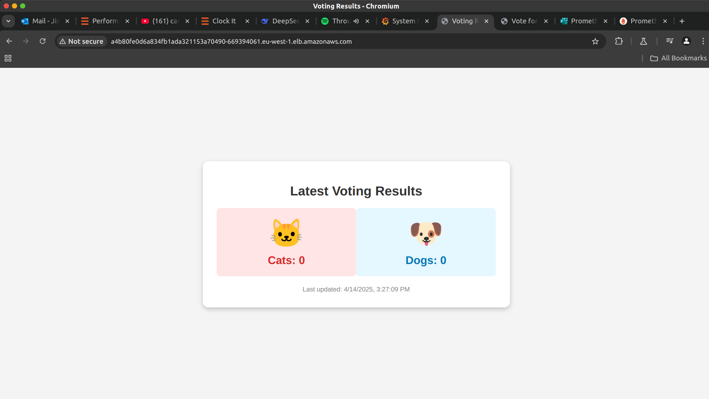

# Terraform AWS Infrastructure Automation Project

## Overview

This project demonstrates infrastructure automation on AWS using Terraform, Docker, and Kubernetes. The implementation creates two deployment paths:
1. **EC2 with Docker**: Provisioning EC2 instances that automatically deploy Nginx containers
2. **EKS Cluster**: Deploying a complete voting application on Kubernetes

The entire process is automated with Jenkins CI/CD pipelines that handle both infrastructure provisioning and application deployment.

## Architecture

### Voting Application Components
- **Voting App**: Flask application for collecting votes
- **Result App**: Node.js application for displaying voting results
- **Worker**: .NET service that processes votes from Redis and stores them in PostgreSQL
- **Databases**: Redis for temporary storage and PostgreSQL for persistent storage

### Infrastructure Components
- **Modular Terraform Design**: Reusable modules for VPC, EC2, Security Groups, and EKS
- **Remote State Management**: AWS S3 for state files with DynamoDB for state locking
- **CI/CD Integration**: Jenkins pipelines for infrastructure provisioning and deployment

## Infrastructure Setup

### EC2 with Docker Deployment
This setup uses Terraform to provision EC2 instances with proper networking and security groups. The userdata script automatically installs Docker and deploys an Nginx container.

Key features:
- Modular VPC and subnet configuration
- Security groups for web access
- EC2 auto-provisioning with Docker
- Automatic Nginx container deployment

### EKS Cluster Deployment
The Kubernetes cluster is provisioned using Terraform with complete networking and security configuration. The voting application runs as containerized microservices on this cluster.

Key features:
- EKS cluster with configured node groups
- IAM roles for cluster operation
- Modular VPC design with public and private subnets
- Complete network isolation and security

## CI/CD Pipeline

### Jenkins Pipeline Structure
- **Component Pipelines**: Individual pipelines for the voting app, result app, and worker components
- **Main Pipeline**: Orchestrates the entire process including infrastructure provisioning

### Workflow
1. Code is pushed to the Git repository
2. Jenkins detects changes and triggers the main pipeline
3. Component pipelines build Docker images and push them to DockerHub
4. If deployment is activated, Terraform provisions the infrastructure
5. Kubernetes deployment scripts create the necessary resources on the cluster

## Setup Instructions

### Prerequisites
- AWS Account with appropriate permissions
- Jenkins server with necessary plugins
- Docker and Terraform installed
- AWS CLI configured

### Jenkins Credentials Setup
1. Create DockerHub credentials: `dockerhub-credentials`
2. Create AWS credentials: `aws-credentials`
3. Create Kubernetes config: `kube-config`

### Pipeline Setup
1. Create Jenkins pipeline jobs using the provided Jenkinsfiles
2. Configure the main pipeline with a parameter `DEPLOY` (yes/no)
3. Run the pipeline to build and deploy the application

### Running the EC2 Deployment
```bash

terraform init
terraform plan
terraform apply ec2_deployment
```

### Running the EKS Deployment
```bash
terraform init
terraform plan
terraform apply eks_deployment

# Deploy the application
./kubernetes/cat_dog.sh
```

## Terraform Remote State

State files are stored in an S3 bucket with state locking via the native state locking mechanism of Terraform:

```hcl
terraform {
  backend "s3" {
    bucket         = var.bucket_name
    key            = var.key
    region         = var.region
    encrypt        = true
    use_lockfile   = true
  }
}
```

## Future Improvements

- Implement auto-scaling for both EC2 and EKS
- Add monitoring and alerting with Prometheus and Grafana
- Implement blue-green deployment strategy
- Integrate with infrastructure testing frameworks


## Relevant Images










